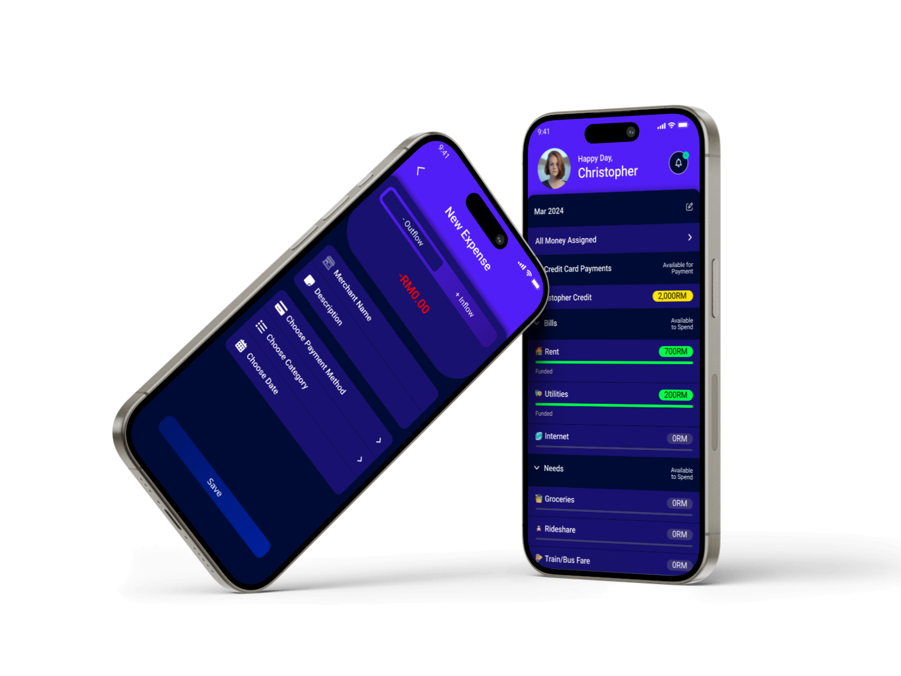

# Budgetly App

Welcome to the future of personal finance management with Budgetly. Our zero-based budgeting app is poised to revolutionize the way you handle money, offering seamless features like SMS expense tracking, receipt scanning, and credit card score monitoring. Get ready to take control of your finances like never before.

# Features
- Receipt Scanning
- Bank SMS Expenses Tracking
- AI for providing better goals
- Blockchain for secure env
- NFT for trading edu content

# Benefits
- Pay your bills —without breaking a sweat.
- Figure out how to afford what you actually want.
- Build a secure (but exciting) financial future.

# Demo
https://github.com/AbdElrahmanaymen/Budgetly/assets/30832681/8e49e76f-ae59-434b-8f20-cce8b08ac344

# Links
- [Figma Design](https://www.figma.com/file/p8XMqf8xmEWY0VVpAshWr3/Budgetly?type=design&node-id=80%3A769&mode=design&t=izlqDINfOCjRRf4E-1)
- [Pitch Deck Presentation](https://docsend.com/view/nex5qtei5j2wpt4j)
